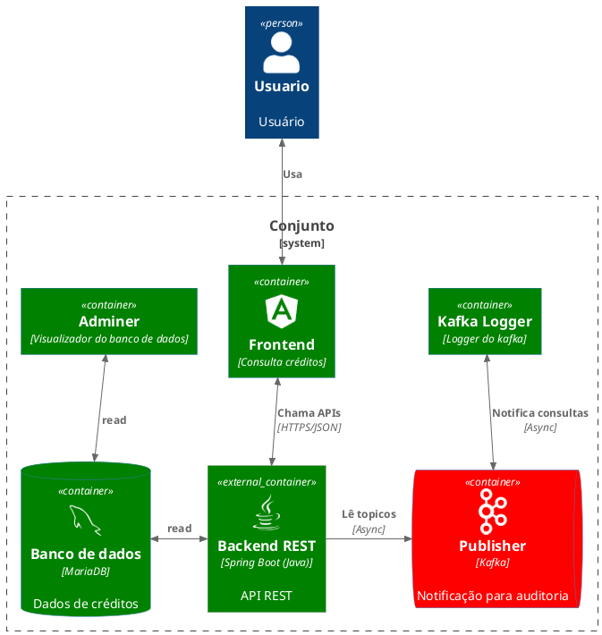
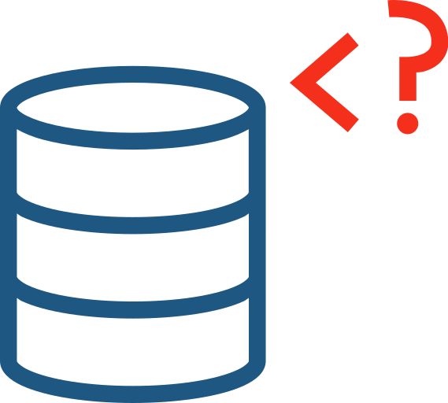

# Crédito Guide

[](#)
[](#)
[](#)
[](#)

---

## 📌 Visão Geral

O **Crédito Guide** é uma aplicação para **consulta e gestão de créditos constituídos**, construída com **Spring Boot + Angular**, utilizando **MariaDB**, **Apache Kafka** e **Flyway**, e organizada segundo os princípios de **Clean Architecture / Arquitetura Hexagonal (Ports & Adapters)**.

O projeto preserva a estrutura original e seus componentes, adicionando organização arquitetural, documentação técnica e práticas corporativas.

---
## Diagrama


---

## 🧱 Arquitetura Corporativa (Clean Architecture + Ports & Adapters)

### Fluxo de Dependências

A aplicação segue dependências unidirecionais, onde **frameworks e detalhes técnicos ficam nas bordas**:

```
[ Frontend (Angular) ]
          ↓
[ Adapter In (Web / Controllers) ]
          ↓
[ Application (Services / Use Cases) ]
          ↓
[ Domain (Regras / Exceções) ]
          ↑
[ Adapter Out / Infra (JPA, Kafka, Health, Config) ]
```

---

## 🗂 Estrutura Real do Projeto

### Backend

```
backend
└── src/main/java/com/andrecs2/credito_guide
    ├── adapter
    │   ├── in
    │   │   └── web            # Controllers REST + Exceptions HTTP
    │   └── converter          # Conversões DTO ↔ Domain
    ├── application
    │   ├── entity             # Entidades de aplicação (DTOs / Enums)
    │   ├── ports
    │   │   ├── repository     # Portas de persistência
    │   │   └── service        # Portas de serviços
    │   └── service            # Implementação dos casos de uso
    ├── domain
    │   └── exception          # Exceções de negócio
    ├── infra
    │   ├── health             # Health indicators
    │   └── response           # Wrappers de resposta
    ├── config                 # Configurações Spring
    └── util                   # Utilitários comuns
```

### Recursos

```
src/main/resources
└── db
    └── migration               # Flyway migrations
```

---

## 🧠 Responsabilidade por Camada

| Camada              | Responsabilidade                   |
| ------------------- | ---------------------------------- |
| adapter.in          | Entrada HTTP (REST)                |
| adapter.converter   | Mapeamento DTO ↔ Domain            |
| application.service | Casos de uso / regras de aplicação |
| application.ports   | Contratos (interfaces)             |
| domain              | Regras de negócio puras            |
| infra               | Integrações técnicas               |

---

## 🧰 Tecnologias e Frameworks

| Categoria       | Tecnologias                     |
| --------------- | ------------------------------- |
| Plataforma      | Spring Boot 3.2.5               |
| Linguagem       | Java 17                         |
| Persistência    | Spring Data JPA / Hibernate     |
| Migrations      | Flyway                          |
| Banco           | [MariaDB](https://mariadb.org/) |
| Mensageria      | Apache Kafka                    |
| Documentação    | Swagger / OpenAPI               |
| Testes          | JUnit 5, Mockito                |
| Frontend        | Angular 21.1.0                  |
| Infra           | Docker / Docker Compose         |

---

## 🗄 Banco de Dados e Flyway

O **MariaDB**  é o banco relacional principal.

* [`http://${BD_HOST}$:${BD_PORT}/${DB_NAME}`]()
* Persistência via Spring Data JPA
* Schema versionado com **Flyway**

### Local das migrations

```
src/main/resources/db/migration
```

### Exemplo

```
V1__create_credito_table.sql 
V2__insert_sample_data.sql
```

---
## Adminer DB  


[`http://${ADMINER_HOST}:${ADMINER_PORT}/?server=${DB_HOST}&username=${DB_USER}&db=${DB_NAME}`]()

---
## Backend API   

[`http://${BACKEND_HOST}:${BACKEND_PORT}`]()

### Swagger UI  

[`http://${BACKEND_HOST}:${BACKEND_PORT}/swagger-ui/index.html`]()

### OpenApi  
 
[`http://${BACKEND_HOST}:${BACKEND_PORT}/v3/api-docs`]()

### 📄 Exemplos de Payloads da API

### Retorna lista Créditos

**GET** `/api/creditos/{numeroNfse}`

RESPONSE
```json
[
  {
    "numeroCredito": "123456",
    "numeroNfse": "7891011",
    "dataConstituicao": "2016-02-25",
    "valorIssqn": 1500.75,
    "tipoCredito": "ISSQN",
    "simplesNacional": "Sim",
    "aliquota": 5.0,
    "valorFaturado": 30000.00,
    "valorDeducao": 5000.00,
    "baseCalculo": 25000.00
  }
]
```
### Retorna detalhes Crédito

**GET** `/api/creditos/credito/{numeroCredito}`

RESPONSE
```json
{
"numeroCredito": "123456",
"numeroNfse": "7891011",
"dataConstituicao": "2016-02-25",
"valorIssqn": 1500.75,
"tipoCredito": "ISSQN",
"simplesNacional": "Sim",
"aliquota": 5.0,
"valorFaturado": 30000.00,
"valorDeducao": 5000.00,
"baseCalculo": 25000.00
}
```

---


## ❤️ Health Check

Health [`http://${BACKEND_HOST}:${BACKEND_PORT}/actuator/health`]()

---

## 🧪 Testes

* Testes de serviço (application)
* Testes de adapter (web)

```bash
$ ./mvnw test
```


---

##   Frontend (Angular)

Localizado em `front-creditos`:

* Componentes desacoplados
* Services para comunicação HTTP
* Interceptors para cross-cutting concerns

Executar o frontend
```bash
$ cd front-creditos
$ npm start
```


Acessar -> [`https://${FRONTEND_HOST}$:{FRONTEND_PORT}`]()

---
##  Mensageria – Apache Kafka 

### Tópicos

| Tópico               | Descrição          |
| -------------------- | ------------------ |
| `credito.consulta`   | Crédito Consulta     |

### Exemplo de Evento

```json
{
  "creditoId": 123,
  "cpfCnpj": "12345678900",
  "valor": 1500.75,
  "dataCriacao": "2026-01-21T10:15:00"
}
```

---

## Executar a aplicação 

```bash 
$ docker compose up
# ou docker compose up -d
```
---