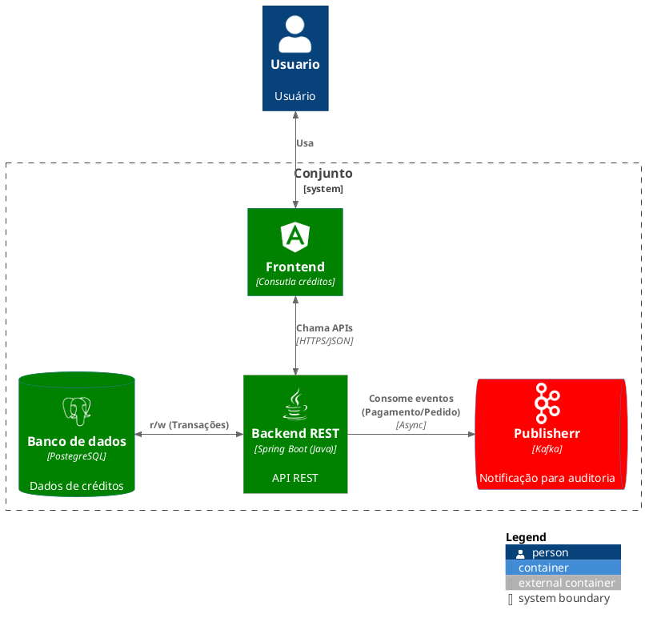

# credito-guide
Projeto voltado à criação de uma solução para consulta de créditos constituídos, com API RESTful em Spring Boot para gestão e fornecimento de dados e front-end em Angular, que oferece interface intuitiva e responsiva integrada à API, garantindo navegação fluida e experiência eficiente ao usuário.

# Tecnologias
-------------------------------------------------------------------------------------
| Back-end| Banco de Dados|Front-end|Containerização|Mensageria|Testes Automatizados|
|---------|---------------|---------|---------------|----------|--------------------|
|Java 8+  |PostgreSQL     |Angular 2+|Docker        |Kafka     |JUnit|
 |   Spring Boot 4.0.1|||||Mockito|
   | Spring Data JPA||||||
   | Hibernate|||||

# Diagrama

